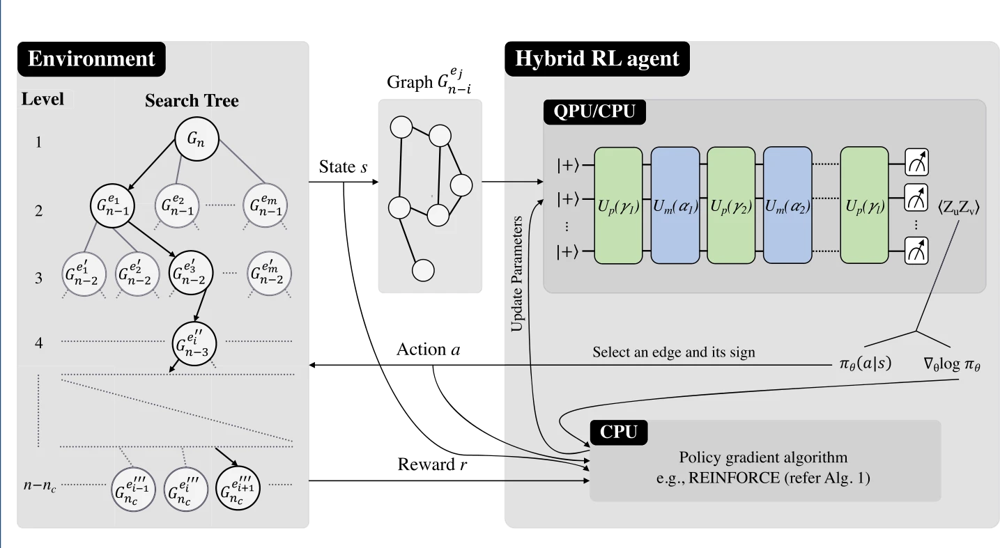
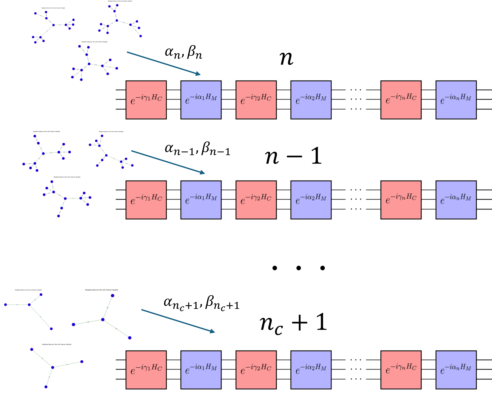

# **Pasqal Challenge - Simulation Code**

Welcome to the **Pasqal Challenge** simulation code page.

## **Theme Suggestion: Quantum + Reinforcement Learning + Tensor Network (T-Warm Up RL QAOA)**

### **Quantum + Reinforcement Learning = RL QAOA**  
[Reference](https://epjquantumtechnology.springeropen.com/articles/10.1140/epjqt/s40507-023-00214-w)

**RL QAOA** is an enhanced version of the traditional Recursive QAOA (RQAOA) with reinforcement learning (RL) integrated to improve performance.

---

  
[Reference](https://epjquantumtechnology.springeropen.com/articles/10.1140/epjqt/s40507-023-00214-w)

---


## **Training Sequence**

1. **Initial Execution:**  
   - Run the QAOA layer on the given graph and measure the expectation values of each edge $( \langle Z_i Z_j \rangle )$.
   
2. **Softmax Edge Selection:**  
   - Multiply the measured $ZZ$ values with the learned parameter $\beta$.
   - Perform softmax on $|Z_i Z_j|\cdot\beta$ and select an edge probabilistically.
   - Compute the gradient of the selected edge.

3. **Graph Reduction:**  
   - Depending on whether the selected edge has a positive or negative correlation, perform an RQAOA step and reduce the graph.

4. **Iteration:**  
   - Repeat steps 1-3 until the number of nodes is reduced to a predefined threshold $n_c$.

5. **Classical Computation:**  
   - Once the graph size reaches $n_c$, compute all possible combinations classically to find the lowest energy solution.
   - Reward high-performing selection steps and penalize suboptimal choices to improve parameter learning.

---

## **Advantages of RL QAOA**

1. **Handling Ties in Edge Selection:**  
   - In standard RQAOA, ties frequently occur where multiple edges have nearly identical $|Z_i Z_j|$ values.  
   - RL QAOA improves this by adjusting these values with learned beta parameters.

2. **Improved Optimization Strategy:**  
   - Traditional RQAOA optimizes the Hamiltonian without guaranteeing optimal edge selection.  
   - RL QAOA avoids this issue by focusing on learning better edge selection policies rather than solely optimizing the Hamiltonian.

3. **Advanced Reinforcement Learning Techniques:**  
   - RL QAOA can leverage more sophisticated reinforcement learning strategies for enhanced performance beyond basic methods.

## **Limitations of RL QAOA**

Despite its advantages, RL QAOA has the following challenges:

1. **High Computational Resource Demand:**  
   - Running multiple episodes requires significant computational resources.

2. **Slow Convergence from Random Initial States:**  
   - Starting from completely random parameters may take a long time to reach a state that includes the minimum energy configuration.

3. **Error Sensitivity in Recursive Process:**  
   - A single incorrect decision during the RQAOA process can lead to suboptimal parameter updates across all layers, causing instability in learning.

### **Key Insight:**  
To achieve high efficiency with deeper QAOA layers, the initial parameters should be of reasonably good quality.

---

## **Tensor Network Warm-Up Approach**

**Tensor Network Warm-Up** provides a solution to the challenges above by leveraging graph structures that are easier to compute classically.  
By applying similar weight distributions to such graphs, we can pre-train the QAOA parameters, leading to a better starting point for RL QAOA.

### **Key Hypothesis:**  
Using pre-trained parameters obtained from tensor network graphs can significantly improve training speed and success rate.

The impact of this approach can be observed in the **`RL_QAOA_test.ipynb`** file, where warm-up initialization shows a significant improvement in learning efficiency.

---

  

---


## **How to Use**

### **1. Clone the repository:**  
   ```bash
   git clone https://github.com/your-username/pasqal-challenge.git
   cd pasqal-challenge
   ```

### **2. Download requirements:**
   ```
   bash
   pip install -r requirements.txt
   ```


### **3. Follow instructions from RL_QAOA_simulation.ipynb:**
